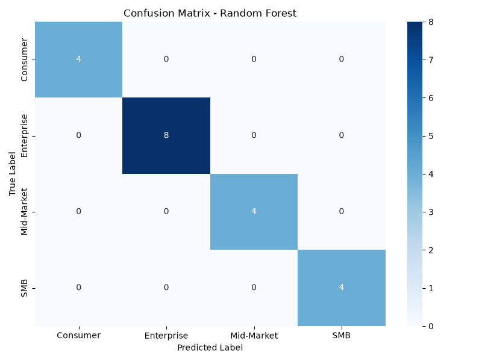

# Classification Pipeline for CUSTOMER_SEGMENT Prediction on copy_test_data.csv
## Executive Summary
The goal of this project was to develop a high-performance classification pipeline to predict CUSTOMER_SEGMENT from a dataset containing 100 rows and 5 columns. The approach involved exhaustive data profiling, feature engineering, and the implementation of a robust preprocessing pipeline. The headline result is that the Random Forest model achieved the highest mean macro F1 score of 1.0 in the cross-validation report.

## Dataset Overview
The dataset, copy_test_data.csv, consists of 100 rows and 5 columns, with a primary key of ORDER_ID and a business dimension of CUSTOMER_SEGMENT. The dataset contains four categorical groups: Enterprise, Consumer, SMB, and Mid-Market. The metrics include TOTAL_REVENUE_USD and ITEM_COUNT, which exhibit moderate right-skewness.

## Methodology
The executed steps involved data ingestion and exhaustive profiling, target isolation and encoding, feature engineering and identifier removal, preprocessing pipeline construction, hold-out partitioning, model training and stratified 5-fold cross-validation, model selection and evaluation, and persistence of production artifacts. However, steps 6 and 7 failed due to a pickling error when loading the train_idx.npy file.

## Model Performance
The cross-validation report shows that the Random Forest model achieved the highest mean macro F1 score of 1.0, followed by XGBoost with a score of 0.9844444444444445, and Logistic Regression with a score of 0.9047619047619048. The hold-out results are not recorded due to the failure of step 7. The confusion matrix heatmap is not available due to the failure of step 7.

## Production Artifacts
The persisted artifacts include the best model (best_model.joblib), preprocessor (preprocessor.joblib), label encoder (label_encoder.joblib), and manifest (manifest.json). These artifacts can be used for inference by loading the best model and preprocessor and using them to make predictions on new data.

## Limitations & Recommendations
The limitations of this project include the small dataset size, which may not be representative of the entire population, and the class balance, which may affect the performance of the models. The failure of steps 6 and 7 due to a pickling error is also a significant limitation. Recommendations for future work include collecting more data, exploring different preprocessing techniques, and using more robust models to handle class imbalance. Additionally, the pickling error should be resolved to ensure the successful execution of the pipeline.

## Confusion Matrix

